# HW2 Website

## Usage
In order to run code, you would run cmake --build build -j, then run ./build/rt168 <scene_file> <mirror_on>.
For mirror on, the options are "on" or "off". It is used to turn off the reflections in order to test both homework 1 and homework 2 without having to alter the code each time.

## Analytic Direct Integrator
For the simple Analytic Direct Integrator, I added integratorType to the scene description in order to toggle it at Engine.cpp. The default is set to raytracer, and the other options are analyticdirect and direct. I made Analytic Direct Integrator and Direct Integrator both inherit the Integrator class. The rest of the calculations for the Analytic Direct Integrator were derived from the formula on edX Edge Course. In order to make the area light visible, I added two triangles for each quad light and then added a boolean into the material struct in order to check if they were light sources or not. I also added a default material for light sources. By doing so, I was able to check in the beginning of the ray tracing function to determine if the hit material was a light source and if so, just return the emission.

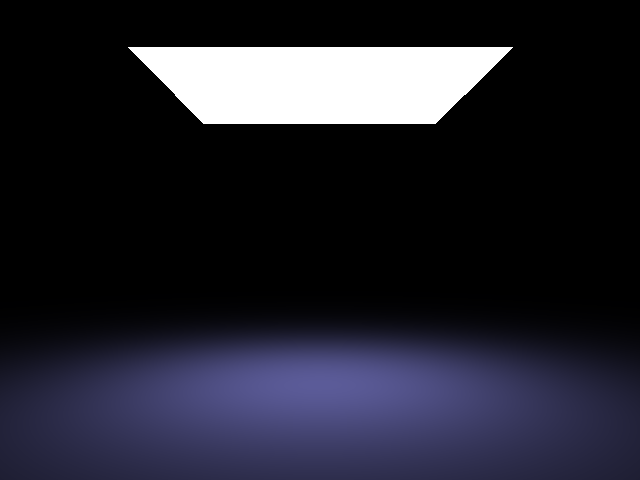  
Here is the result from running analytic.test   

## Direct Integrator
For this one, I added two more commands and set those up accordingly in SceneLoader.cpp. I created a function called quadShader in because the shading algorithm in itself is the same whether the samples were stratified or not. The only difference were the sample points, so they were included in the parameters. For random sampling, I used the rand function from std.

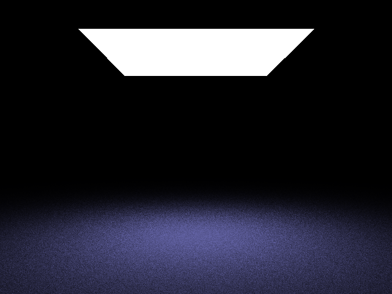  
Here is the result from running direct9.test  

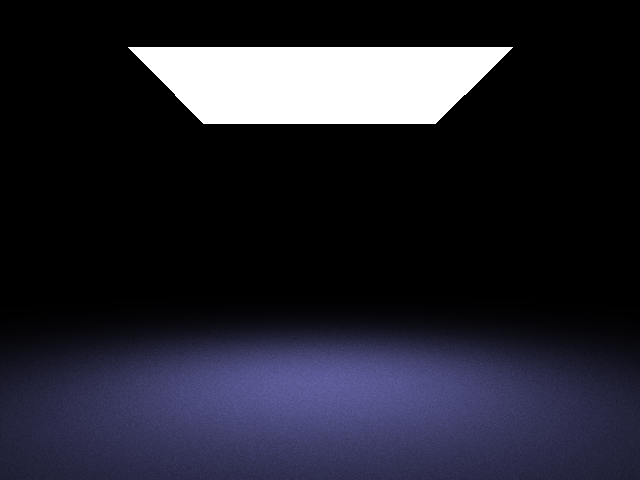  
Here is the result from running direct3x3.test  

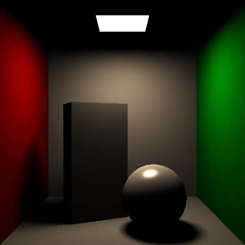  
Here is the result from running cornell.test  

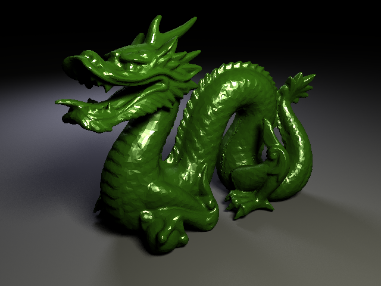  
Here is the result from running dragon.test  

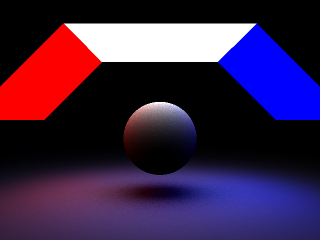  
Here is the result from running sphere.test  

## Point Light Experimentation
After finishing up the Analytic Direct Integrator and Direct Integrator, I wanted to test out a more physically accurate point light implementation. So, I added this into the Direct Integrator point lights for now. Currently, the scenes files in hw1 are edited to include "integrator direct" as a way to check if this point light implementation was working or not. I had trouble with this due to the fact that the lights kept becoming too bright or too dim. My initial thought was that the area would be the surface area of the sphere, so the brightness would just be multiplied by 4 * PI * R^2. However, this resulted in an overly bright image. I isolated the problem to diffuse light, so I used scene4-diffuse.test as a way to check my shading algorithm. The lights kept being off, and the best result occurred when I multiplied by PI * R^2, so I left it at that. However, when I tried to implement the specular light, the specular portion became overly bright. So, I decided to try multiplying out the PI to the kd/PI and then not multiplying PI to the specular light. I do understand that this is not mathematically correct, so I'm currently in the middle of deciphering what the issue is. The end result was pretty nice, although the specular light was still pretty bright.

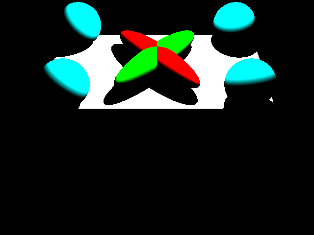  
Here is the result from running scene4-diffuse.test with 4 * PI  

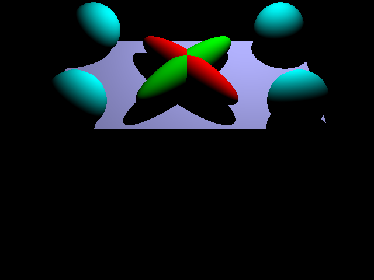  
Here is the result from running scene4-diffuse.test with PI  

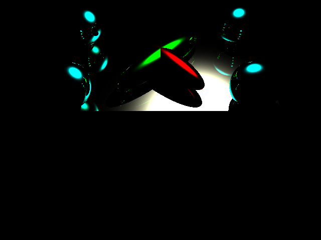  
Here is the result from running scene4-specular.test with PI  

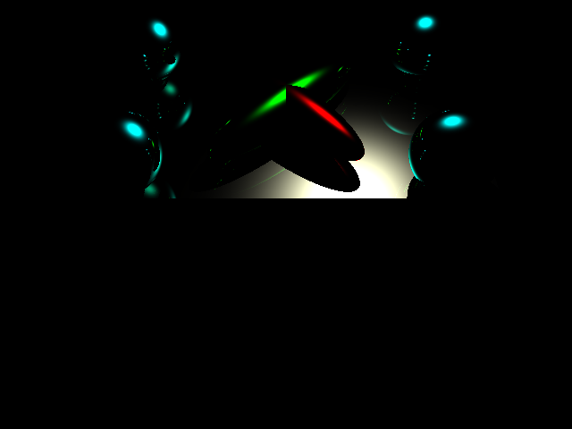  
Here is the result from running scene4-specular.test without PI  

I tried running the rest of the scenes with the PI only being multiplied to kd/PI

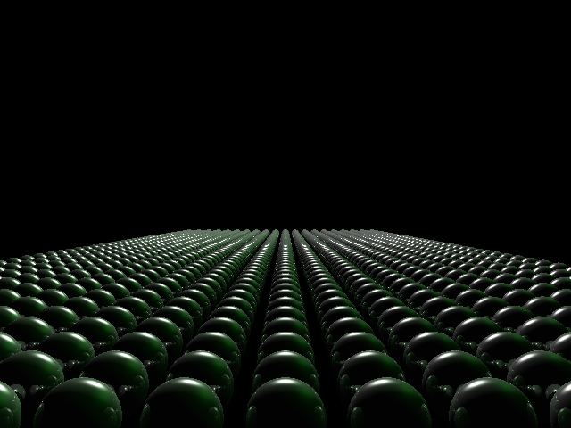  
Here is the result from running scene5.test  

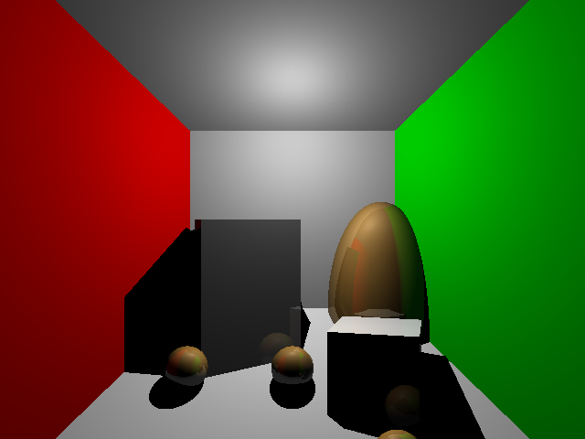  
Here is the result from running scene6.test  

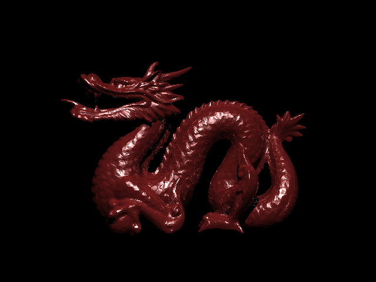  
Here is the result from running scene7.test  
